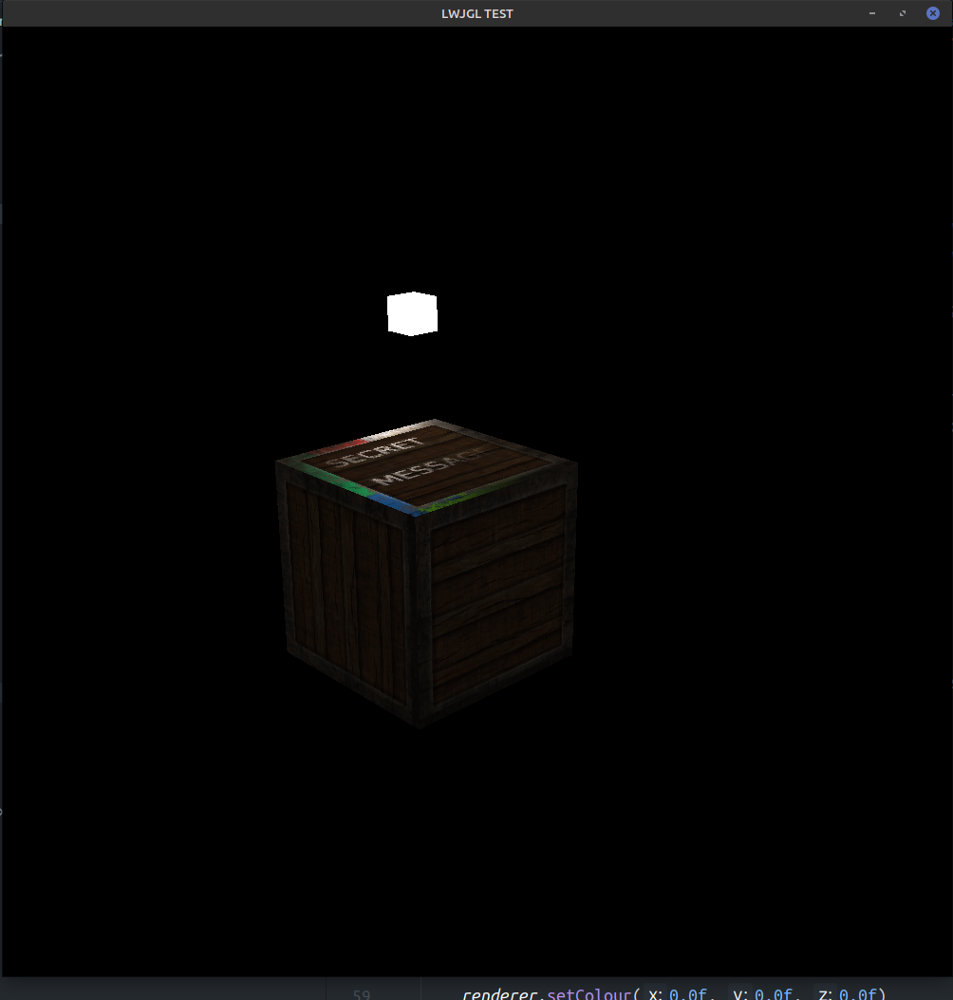

# Phong Lighting
___

## Different Components
Phong lighting consists of three components that are each added together.

This phong is implemented into worldspace.

Ambient Shading: Default lighting for when there is not a light source (no light)

Diffuse Shading: An objects colour is affected by the position of the light (lighting)

Specular Shading: The objects colour is affected by the position of the camera (reflections)

## Info

Thanks learnopengl and lighthouse3d for information on this lighting model

Texture https://pixabay.com/photos/vintage-wood-texture-wooden-wall-1557993/
https://pixabay.com/photos/background-texture-grunge-metal-1180666/
https://pixabay.com/illustrations/silver-background-texture-2143730/